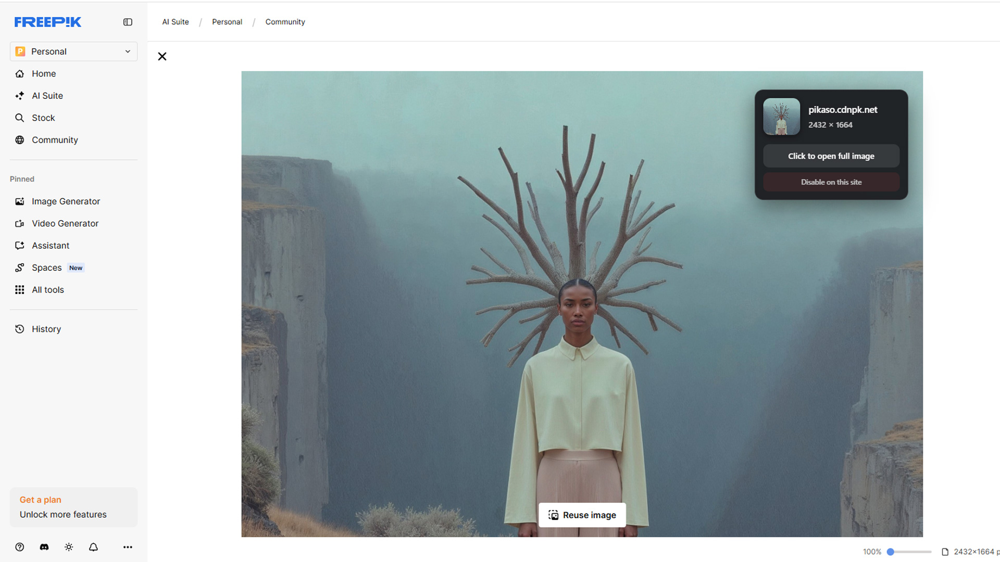
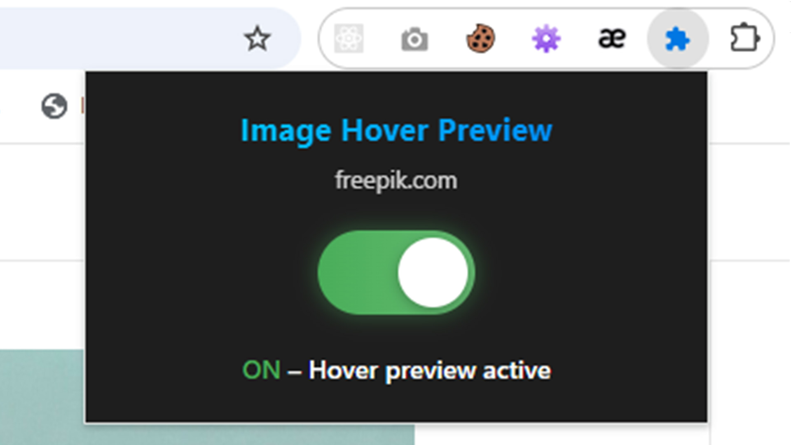

# Image Hover Preview ✨

**The most beautiful image hover preview extension for Chrome (2025)**

Hover any image → instantly see a sleek floating preview with:
- Real thumbnail
- Domain name
- Exact dimensions
- One-click open
- Per-site toggle via stunning ON/OFF switch

No ads • No tracking • No bloat • Built with love

### Features
- Works on Instagram, Twitter/X, Reddit, Pinterest, ArtStation, etc.
- Disable/enable per website with one click
- Gorgeous glassmorphism popup with smooth animations
- Toggle via extension icon (beautiful animated switch)
- Zero performance impact
- Fully open source & privacy-first

### Screenshots

### Installation (Developer Mode)
1. Download this repo as ZIP
2. Extract → Open Chrome → `chrome://extensions`
3. Enable **Developer mode** → Click **Load unpacked**
4. Select the folder → Done!

### Publish to Chrome Web Store
Just zip the entire folder and upload — already 100% Manifest V3 compliant.

### License
Praveen Sasikumar © 2025

⭐ **Star this repo if you love it!**